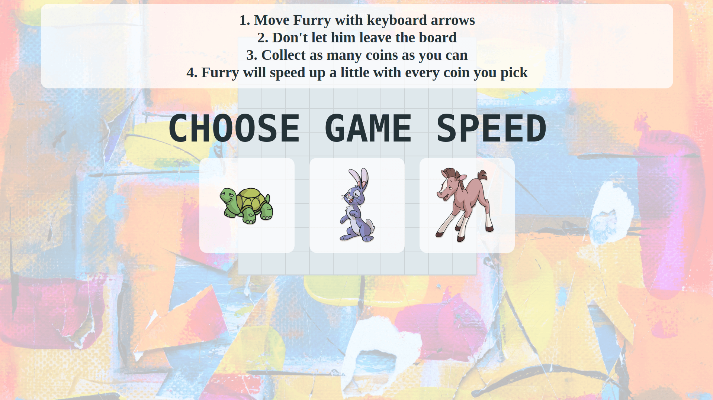
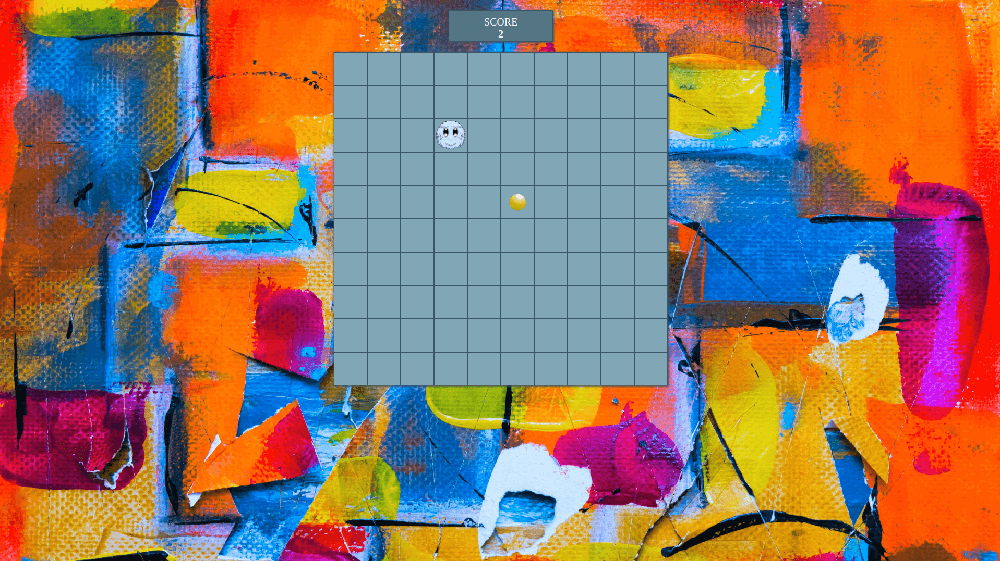

# Furry Game

Workshop within Coder's Lab JavaScript course.

The aim of the workshop is to create a simple game basing on provided description.

The aim of the game is to collect as many coins as possible using keyboard arrows to steer creature named Furry. Furry moves by itself and pressing arrow key changes his movement's direction.

The game was later modified by me by:
* adding possibility to choose Furry's speed
* adding sounds
* improving styling

Technologies used:
* JavaScript
* HTML
* Sass
* Gulp

Preview:

https://nyziek.pl/projects/furry_game/

Screenshots:

